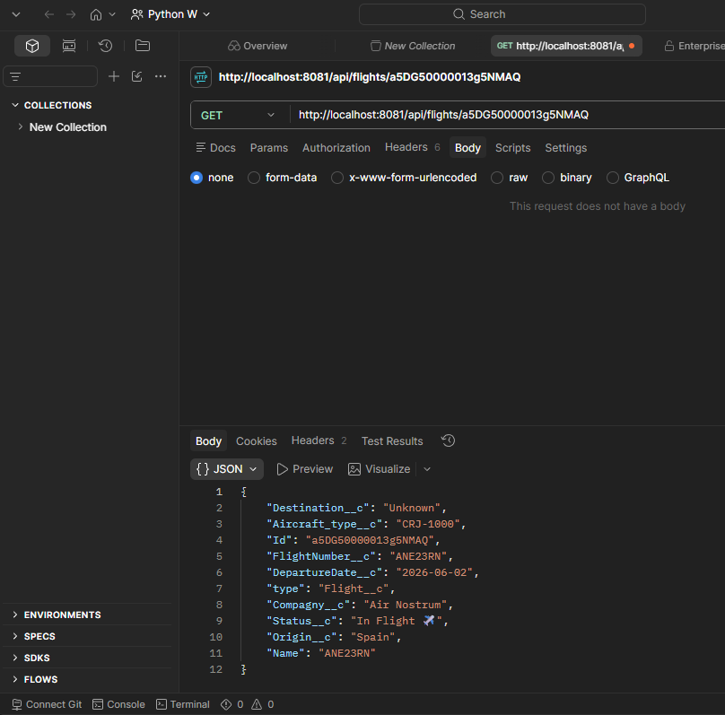
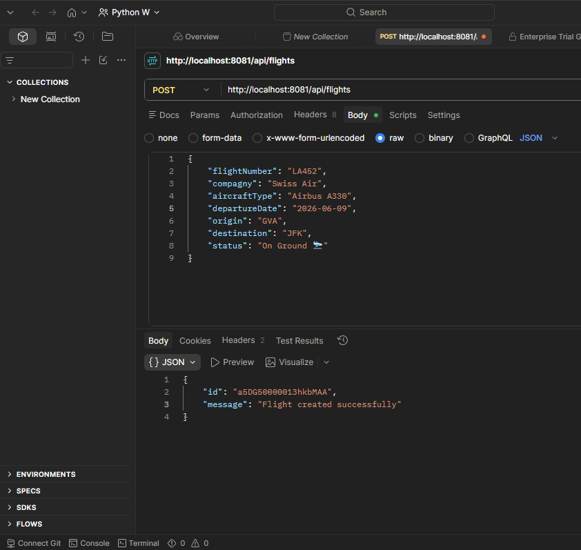

## 🚀 Live Demo
Base URL : `https://flights-crud-api-lxelir.5sc6y6-4.usa-e2.cloudhub.io`

| Method | Endpoint | 
|---|---|
| GET | /api/flights |
| GET | /api/flights/{id} |
| POST | /api/flights |
| PUT | /api/flights/{id} |
| DELETE | /api/flights/{id} |


# ✈️ Flights CRUD API — MuleSoft

> 🇬🇧 English version | 🇫🇷 Version française ci-dessous

---

## 🇬🇧 English

Full CRUD REST API for managing Salesforce Flight__c records via MuleSoft.

### Architecture

### Stack
- MuleSoft 4.x (Anypoint Studio)
- RAML 1.0
- DataWeave 2.0
- Salesforce Connector
- CloudHub 2.0

### Endpoints
| Method | Endpoint | Description |
|---|---|---|
| GET | /api/flights | Get all flights |
| GET | /api/flights/{id} | Get flight by ID |
| POST | /api/flights | Create a flight |
| PUT | /api/flights/{id} | Update a flight |
| DELETE | /api/flights/{id} | Delete a flight |

### Setup
1. Configure `config.yaml` with your Salesforce credentials
2. Run locally with F5 in Anypoint Studio
3. Or deploy to CloudHub

### Example Request
```json
POST /api/flights
{
    "flightNumber": "LX452",
    "compagny": "Swiss Air",
    "aircraftType": "Airbus A330",
    "departureDate": "2026-06-03",
    "origin": "GVA",
    "destination": "JFK",
    "status": "On Ground 🛬"
}
```

### Example Response
```json
{
    "id": "a5DG50000013hXhMAI",
    "message": "Flight created successfully"
}
```

---

## 🇫🇷 Français

API REST CRUD complète pour gérer les enregistrements Salesforce Flight__c via MuleSoft.

### Architecture

### Stack
- MuleSoft 4.x (Anypoint Studio)
- RAML 1.0
- DataWeave 2.0
- Connecteur Salesforce
- CloudHub 2.0

### Endpoints
| Méthode | Endpoint | Description |
|---|---|---|
| GET | /api/flights | Récupérer tous les vols |
| GET | /api/flights/{id} | Récupérer un vol par ID |
| POST | /api/flights | Créer un vol |
| PUT | /api/flights/{id} | Modifier un vol |
| DELETE | /api/flights/{id} | Supprimer un vol |

### Installation
1. Configurer `config.yaml` avec vos credentials Salesforce
2. Lancer en local avec F5 dans Anypoint Studio
3. Ou déployer sur CloudHub

---

## 📸 Screenshots

### API Flow — Anypoint Studio


### Postman Tests



---

## 🔗 Links
- [Flight Tracker LWC](https://github.com/KarterKiller/flight-tracker-salesforce)
- [Flight Tracker MuleSoft](https://github.com/KarterKiller/flight-tracker-mulesoft)